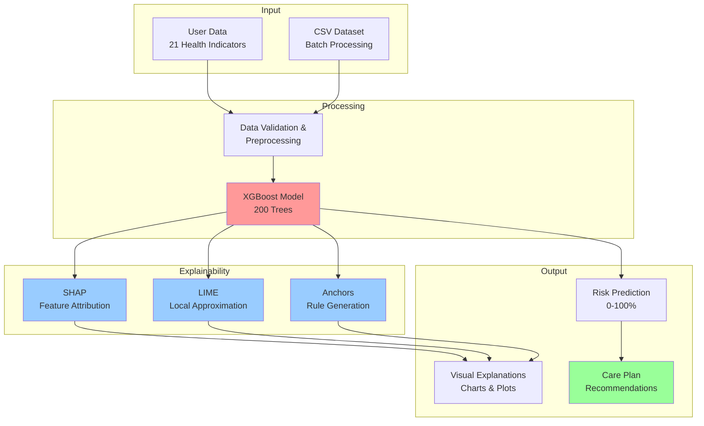
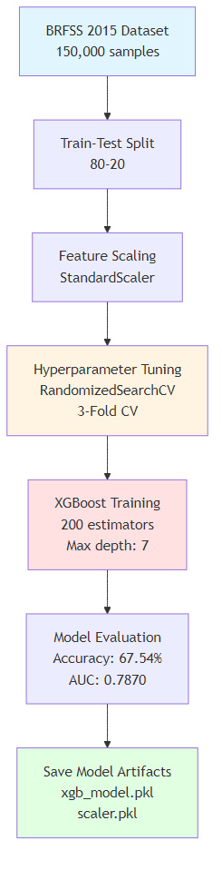

# System Architecture Overview

```mermaid
graph TB
    subgraph "Input"
        A[User Data<br/>21 Health Indicators]
        B[CSV Dataset<br/>Batch Processing]
    end
    
    subgraph "Processing"
        C[Data Validation &<br/>Preprocessing]
        D[XGBoost Model<br/>200 Trees]
    end
    
    subgraph "Explainability"
        E[SHAP<br/>Feature Attribution]
        F[LIME<br/>Local Approximation]
        G[Anchors<br/>Rule Generation]
    end
    
    subgraph "Output"
        H[Risk Prediction<br/>0-100%]
        I[Visual Explanations<br/>Charts & Plots]
        J[Care Plan<br/>Recommendations]
    end
    
    A --> C
    B --> C
    C --> D
    D --> E
    D --> F
    D --> G
    E --> I
    F --> I
    G --> I
    D --> H
    H --> J
    
    style D fill:#ff9999
    style E fill:#99ccff
    style F fill:#99ccff
    style G fill:#99ccff
    style J fill:#99ff99
```
