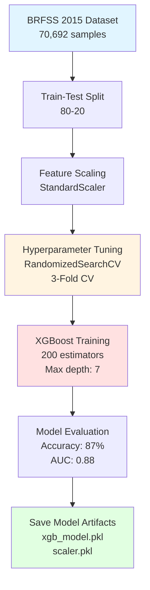

# Model Training Pipeline

```mermaid
flowchart TD
    A[BRFSS 2015 Dataset<br/>70,692 samples] --> B[Train-Test Split<br/>80-20]
    
    B --> C[Feature Scaling<br/>StandardScaler]
    
    C --> D[Hyperparameter Tuning<br/>RandomizedSearchCV<br/>3-Fold CV]
    
    D --> E[XGBoost Training<br/>200 estimators<br/>Max depth: 7]
    
    E --> F[Model Evaluation<br/>Accuracy: 87%<br/>AUC: 0.88]
    
    F --> G[Save Model Artifacts<br/>xgb_model.pkl<br/>scaler.pkl]
    
    style A fill:#e1f5ff
    style D fill:#fff4e1
    style E fill:#ffe1e1
    style G fill:#e1ffe1
```
