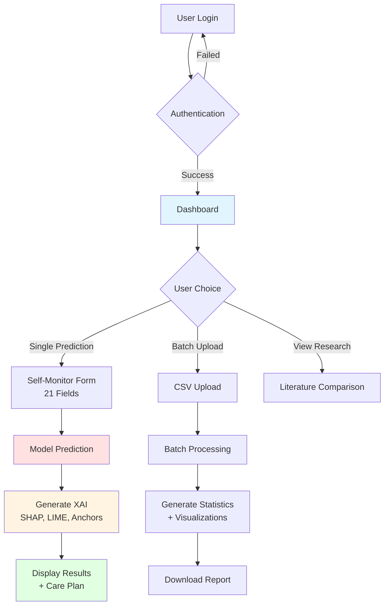
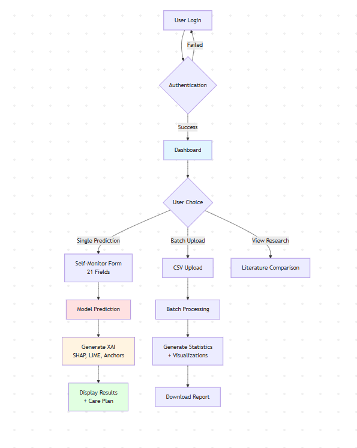

# Application Workflow

```mermaid
flowchart TD
    A[User Login] --> B{Authentication}
    B -->|Success| C[Dashboard]
    B -->|Failed| A
    
    C --> D{User Choice}
    
    D -->|Single Prediction| E[Self-Monitor Form<br/>21 Fields]
    D -->|Batch Upload| F[CSV Upload]
    D -->|View Research| G[Literature Comparison]
    
    E --> H[Model Prediction]
    F --> I[Batch Processing]
    
    H --> J[Generate XAI<br/>SHAP, LIME, Anchors]
    J --> K[Display Results<br/>+ Care Plan]
    
    I --> L[Generate Statistics<br/>+ Visualizations]
    L --> M[Download Report]
    
    style C fill:#e1f5ff
    style H fill:#ffe1e1
    style J fill:#fff4e1
    style K fill:#e1ffe1
```
