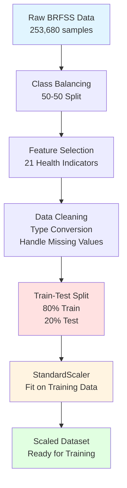
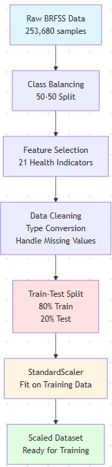

# Data Preprocessing Pipeline

```mermaid
flowchart TD
    A[Raw BRFSS Data<br/>253,680 samples] --> B[Class Balancing<br/>50-50 Split]
    
    B --> C[Feature Selection<br/>21 Health Indicators]
    
    C --> D[Data Cleaning<br/>Type Conversion<br/>Handle Missing Values]
    
    D --> E[Train-Test Split<br/>80% Train<br/>20% Test]
    
    E --> F[StandardScaler<br/>Fit on Training Data]
    
    F --> G[Scaled Dataset<br/>Ready for Training]
    
    style A fill:#e1f5ff
    style E fill:#ffe1e1
    style F fill:#fff4e1
    style G fill:#e1ffe1
```
