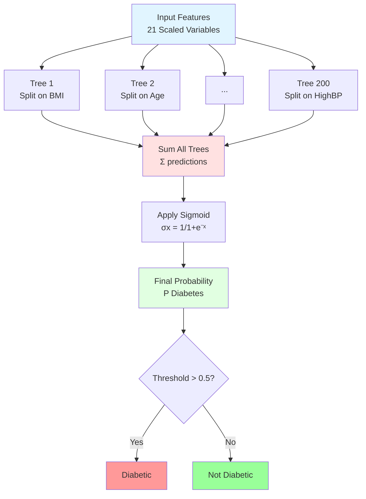

# XGBoost Model Architecture

```mermaid
graph TB
    A[Input Features<br/>21 Scaled Variables]
    
    B[Tree 1<br/>Split on BMI]
    C[Tree 2<br/>Split on Age]
    D[...]
    E[Tree 200<br/>Split on HighBP]
    
    A --> B
    A --> C
    A --> D
    A --> E
    
    F[Sum All Trees<br/>Σ predictions]
    
    B --> F
    C --> F
    D --> F
    E --> F
    
    G[Apply Sigmoid<br/>σx = 1/1+e⁻ˣ]
    F --> G
    
    H[Final Probability<br/>P Diabetes]
    G --> H
    
    I{Threshold > 0.5?}
    H --> I
    
    J[Diabetic]
    K[Not Diabetic]
    
    I -->|Yes| J
    I -->|No| K
    
    style A fill:#e1f5ff
    style F fill:#ffe1e1
    style H fill:#e1ffe1
    style J fill:#ff9999
    style K fill:#99ff99
```
