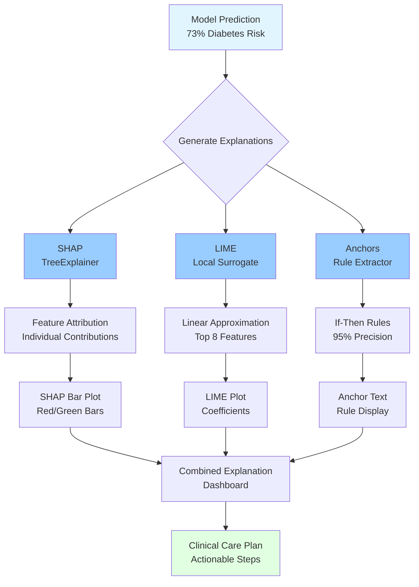
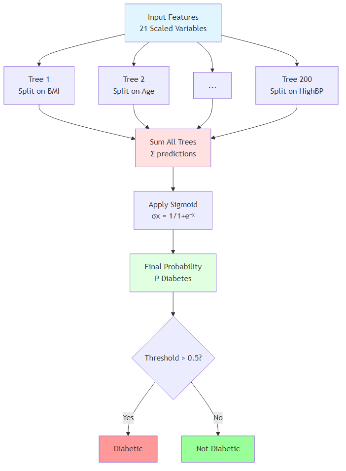

# Explainable AI Integration

```mermaid
flowchart TD
    A[Model Prediction<br/>73% Diabetes Risk] --> B{Generate Explanations}
    
    B --> C[SHAP<br/>TreeExplainer]
    B --> D[LIME<br/>Local Surrogate]
    B --> E[Anchors<br/>Rule Extractor]
    
    C --> F[Feature Attribution<br/>Individual Contributions]
    D --> G[Linear Approximation<br/>Top 8 Features]
    E --> H[If-Then Rules<br/>95% Precision]
    
    F --> I[SHAP Bar Plot<br/>Red/Green Bars]
    G --> J[LIME Plot<br/>Coefficients]
    H --> K[Anchor Text<br/>Rule Display]
    
    I --> L[Combined Explanation<br/>Dashboard]
    J --> L
    K --> L
    
    L --> M[Clinical Care Plan<br/>Actionable Steps]
    
    style A fill:#e1f5ff
    style C fill:#99ccff
    style D fill:#99ccff
    style E fill:#99ccff
    style M fill:#e1ffe1
```
