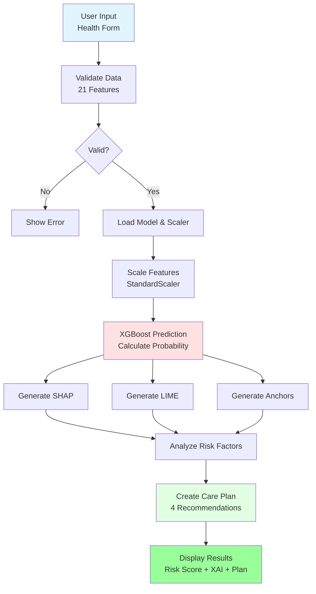
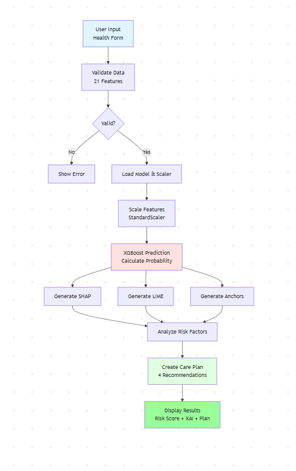

# Single Prediction Workflow

```mermaid
flowchart TD
    A[User Input<br/>Health Form] --> B[Validate Data<br/>21 Features]
    
    B --> C{Valid?}
    C -->|No| D[Show Error]
    C -->|Yes| E[Load Model & Scaler]
    
    E --> F[Scale Features<br/>StandardScaler]
    
    F --> G[XGBoost Prediction<br/>Calculate Probability]
    
    G --> H[Generate SHAP]
    G --> I[Generate LIME]
    G --> J[Generate Anchors]
    
    H --> K[Analyze Risk Factors]
    I --> K
    J --> K
    
    K --> L[Create Care Plan<br/>4 Recommendations]
    
    L --> M[Display Results<br/>Risk Score + XAI + Plan]
    
    style A fill:#e1f5ff
    style G fill:#ffe1e1
    style L fill:#e1ffe1
    style M fill:#99ff99
```
